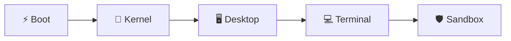
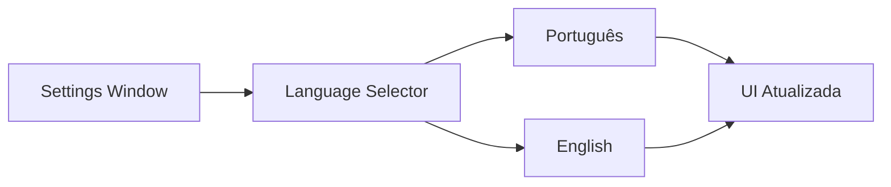
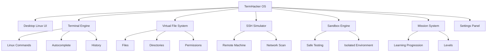
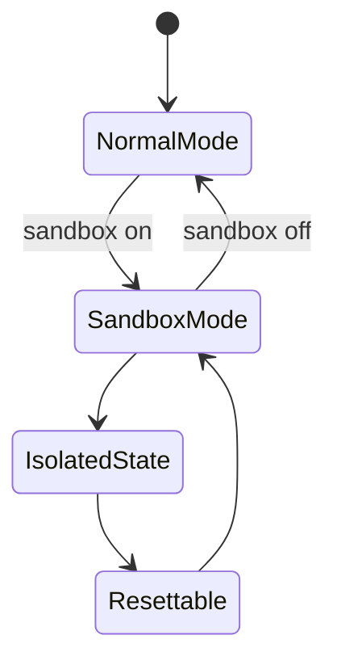
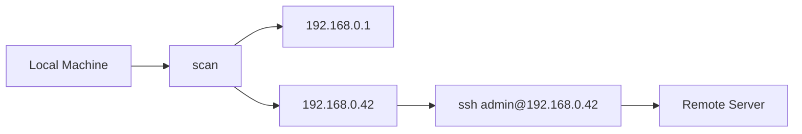
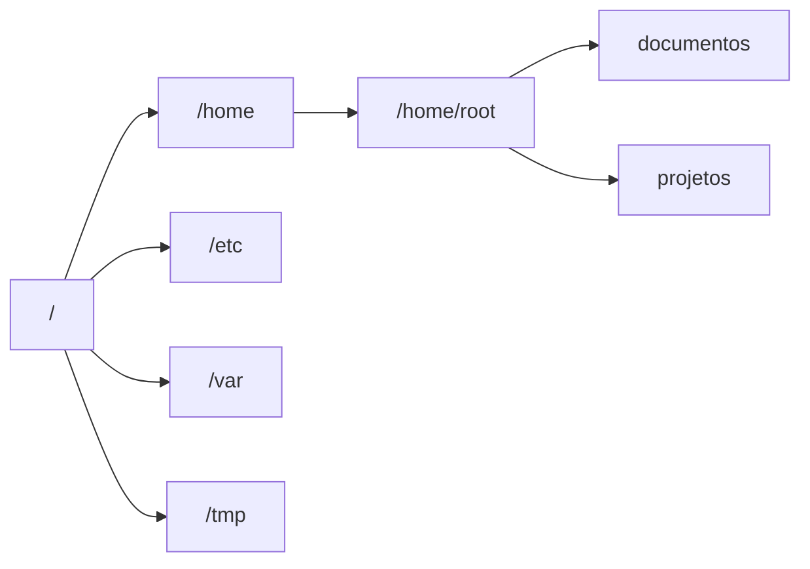
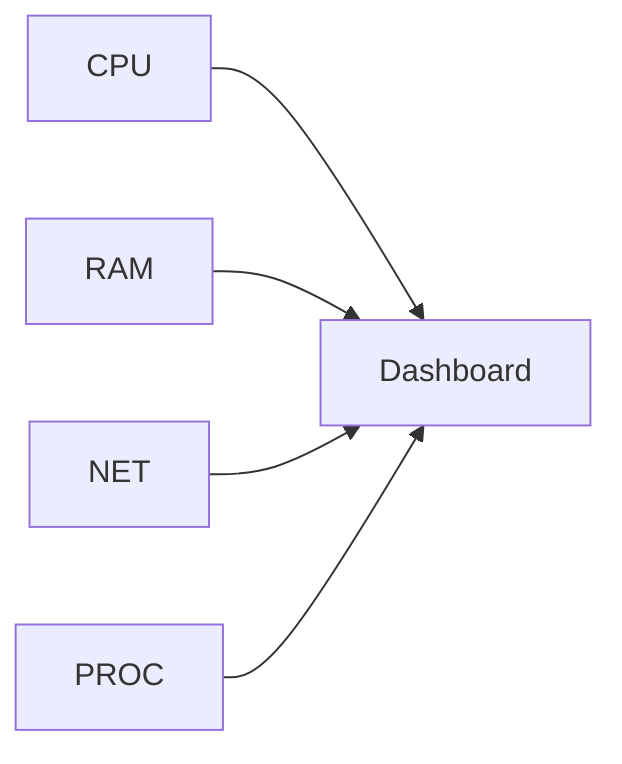
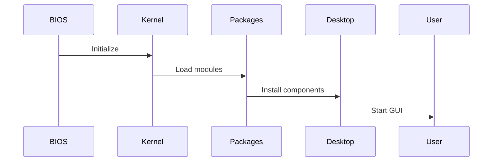

# 🚀 TermHacker OS

<div align="center">




</div>

> Um simulador Linux educacional inspirado em ambientes modernos como GNOME, Kali Linux e terminais hacker.

---

# 🖥️ Visão Geral

O **TermHacker OS** é um ambiente Linux fictício focado em:

* aprendizado de terminal
* exploração de sistemas Linux
* missões educativas
* simulação de SSH
* sandbox seguro
* interface moderna inspirada em distros Linux

---

# ✨ Principais Recursos

## 🎨 Interface Linux Moderna

* Dock estilo GNOME
* Janelas arrastáveis
* Barra superior interativa
* Gerenciador de arquivos estilo Nautilus
* Temas globais
* Monitor do sistema
* Terminal avançado

---

## 🌎 Sistema Multilíngue

O sistema suporta:

* 🇧🇷 Português
* 🇺🇸 English

Com troca dinâmica em tempo real.



---

# 🧠 Estrutura do Sistema



---

# 🛡️ Sandbox Mode

O modo Sandbox transforma o sistema em um ambiente livre para testes.

## 🔥 O que acontece no Sandbox?

* missões são pausadas
* progresso de aprendizado é desativado
* usuário pode testar livremente
* alterações podem ser descartadas
* ambiente isolado



---

# 💻 Terminal Hacker

O terminal possui:

* autocomplete
* histórico
* múltiplas abas
* comandos Linux simulados
* suporte a grep/find/cat/ssh
* visual hacker moderno

## 📦 Comandos disponíveis

```bash
ls
cd
pwd
cat
grep
find
chmod
ping
scan
ssh
sandbox
neofetch
```

---

# 🌐 Simulação de Rede

O sistema possui uma rede fictícia para aprendizado.



---

# 📁 Sistema de Arquivos Virtual

O sistema usa um filesystem virtual completo.



mermaid
graph LR
ROOT[/]

```
ROOT --> HOME[/home]
ROOT --> ETC[/etc]
ROOT --> VAR[/var]
ROOT --> TMP[/tmp]

HOME --> USER[/home/root]

USER --> DOCS[documentos]
USER --> PROJ[projetos]
```

````

---

# ⚙️ Configurações

A nova central de configurações inclui:

- troca de idioma
- seleção de tema
- ativação do sandbox
- personalização visual

```mermaid
flowchart TD
    SETTINGS[Settings Window]

    SETTINGS --> LANG[Language]
    SETTINGS --> THEMES[Themes]
    SETTINGS --> SANDBOX[Sandbox]

    THEMES --> CYAN[Cyan]
    THEMES --> GREEN[Green]
    THEMES --> RED[Red]
    THEMES --> PURPLE[Purple]
````

---

# 🎨 Sistema de Temas

Os temas agora alteram:

* terminal
* janelas
* glow effects
* barra superior
* botões
* dock
* destaques

```mermaid
mindmap
  root((Themes))
    Cyan
    Green
    Purple
    Red
    Amber
    Blue
```

---

# 📊 Monitor do Sistema

O monitor mostra:

* CPU
* RAM
* rede
* processos
* uso do sistema



---

# 🚀 Processo de Boot

Agora o sistema simula:

* carregamento do kernel
* instalação de pacotes
* inicialização do desktop
* boot hacker animado



---

# 🧩 Próximas Melhorias

## 🔮 Futuro do projeto

* suporte multiusuário
* sistema de permissões avançado
* editor de código interno
* navegador fake Linux
* compilador fake C/Python
* monitor de processos realista
* sistema de logs avançado
* notificações estilo KDE/GNOME
* integração WebAssembly
* pseudo Docker containers

---

# 🏁 Resultado

O projeto agora funciona como:

✅ Simulador Linux

✅ Ambiente hacker educativo

✅ Desktop Linux moderno

✅ Sandbox seguro

✅ Plataforma de aprendizado

✅ Interface gamer/hacker

---

# 📌 Filosofia do Projeto

> “Aprender Linux deveria parecer explorar um sistema operacional real.”

O objetivo do TermHacker OS é misturar:

* diversão
* aprendizado
* estética hacker
* UX moderna
* gamificação

em um único ambiente web.

---

# 🐧 Powered by Linux Inspiration

Inspirado por:

* GNOME
* Kali Linux
* Ubuntu
* Arch Linux
* Hyprland
* Hacker terminals
* cyberpunk UI

---

# 🔥 Final

```bash
root@termhacker:~$ neofetch
```

> Bem-vindo ao TermHacker OS.
